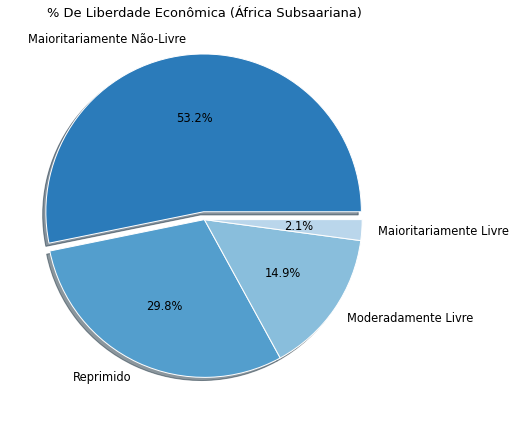
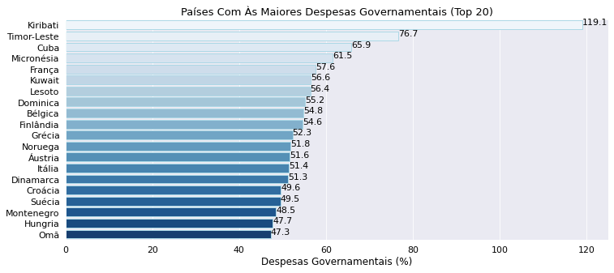

# Índice de Liberdade Econômica (EDA)

Neste projeto, apresento em detalhes uma análise exploratória atinente ao conjunto de dados do Índice de Liberdade Econômica (Index of Economic Freedom), que é uma pesquisa de ranqueamento que visa saber quais são os países mais livres no âmbito econômico e quais não são, além de que tal pesquisa estatística expõe como a liberdade econômica impacta notavelmente na riqueza de uma população.

As ferramentas utilizadas nesta análise exploratória foram Python como linguagem programática, Pandas como biblioteca para manipulação de dados, e por fim às bibliotecas Matplotlib e Seaborn foram utilizáveis conjuntamente para realizar plotagens de gráficos que expusessem com mais facilidade às informações que foram extraídas do conjunto de dados.

## Importação de Bibliotecas

```
import pandas as pd
import numpy as np
import matplotlib.pyplot as plt
import seaborn as sns

```

## Fonte de dados

O dataset [2022 Index Of Economic Freedom](https://www.heritage.org/index/explore) utilizado em tal análise exploratória está hospedado disponivelmente no site da Index Heritage Foundation para uso gratuito.

## Importação do Dataset 

Antes de podermos exportar o conjunto de dados, tivemos que instalar o pacote xlrd para exportarmos o dataset que estava configurado no formato .xlsx.

```
df = pd.read_excel('/content/drive/MyDrive/index2022_data.xls')
```
## Colunas do dataset

As colunas que estão contidas no conjunto de dados do índice de liberdade econômica são:

```
['pais_id', 'pais', 'webname', 'regiao', 'ranking_mundial',
       'ranking_regional', 'pontuacao_2022', 'direitos_de_propriedade',
       'eficiencia_juridica', 'integridade_governamental', 'carga_tributaria',
       'gastos_do_governo', 'saude_fiscal', 'liberdade_de_negocios',
       'liberdade_de_trabalho', 'liberdade_monetaria', 'liberdade_comercial',
       'liberdade_de_investimento', 'liberdade_financeira', 'taxa_tarifaria',
       'sem_nome', 'taxa_imposto_de_renda', 'taxa_de_imposto_corporativo',
       '%_carga_tributacao_pib', 'sem_nome_2', '%_despesas_gov_do_pib',
       'pais_2', 'sem_nome_3', 'populacao_milhoes', 'pib_bilhoes_per_capita',
       '%_crescimento_pib', '%_crescimento_pib_em_cinco_anos',
       'pib_per_capita', '%_de_desemprego', '%_de_inflacao',
       'entrade_de_ide_milhoes', '%_divida_publica_pib']
```       

## Processo de exploração dos dados

### **(1)** Tratamento dos dados

* Exclusão de colunas:

     **(1)** Antes de começarmos a exploração nos dados, tivemos que selecionar às colunas que seriam ou poderiam ser exploradas durante esse processo de análise, de antemão foi perceptível que há colunas que não serão exploráveis, e que à melhor opção seria com que tais colunas fossem excluídas, para que no processo analítico tivéssemos somente às colunas que poderiam ser do nosso interesse informacional.
 
   Tais colunas que foram excluídas, foram: 
   
   ```
   'webname', 'sem_nome_2', 
                   'pais_2', 'sem_nome_3', 'sem_nome'
   ```
* Seleção de índice:

    **(1)** Como temos uma coluna 'pais_id' que serve como identificador de cada país que foi analisado em tal pesquisa, então substituímos o índice automático criado pelo Pandas, para indexarmos a coluna 'pais_id' em seu lugar, justamente para não termos duas colunas de índices no dataset.
 
 
   ```
   df.set_index('pais_id', inplace = True)
   ```
 
 * Renomeação de coluna:

    **(1)** As colunas originalmente estavam escritas em inglês, porém traduzimos o nome das colunas para termos um entendimento mais claro e intuitivo do que cada coluna trata.
 
 * Criação de coluna:

    **(1)** Criamos a coluna 'avaliacao_final' para classificarmos quais são os países majoritariamente livres ou não-livres, moderadamente livres ou reprimidos, tal classificação foi feita com base nos critérios avaliativos da Index Heritage Foundation:
  
     **(a)** Países com uma pontuação de liberdade econômica entre 0 e 49.9 são classificados como países reprimidos, isto é, são países com baixa liberdade econômica.
  
     **(b)** Países com uma pontuação de liberdade econômica entre 50 e 59.9 são classificadamente países não-livres economicamente.
  
     **(c)** Países com uma pontuação de liberdade econômica entre 60 e 69.9 são classificadamente países moderadamente livres.
  
     **(d)** Países com uma pontuação de liberdade econômica acima de 70 são classificados como países majoritariamente livres, isto é, são países com alta liberdade econômica.
  
### **(2)** Conhecimento exploratório dos dados

Antes de começarmos à extrair em detalhes ás informações de tal conjunto de dados, precisamos esclarecer o conceito de liberdade econômica.

Basicamente, um país é considerado livre economicamente se e somente se tal país não tiver ou tiver pouquíssimas regulamentações burocráticas que impeçam a iniciativa privada de funcionar.

Em suma um país é livre economicamente se e somente se o país não tiver um estado que intervenha exageradamente na economia, por exemplo:

   **(a)** Se tal país não tiver regulamentações empresariais e trabalhistas que impeçam um empreendedor de abrir um negócio ou que impeçam um trabalhador de ser contratado. 
  
   **(b)** Se tal país não tiver um estado 'inchado' que atue em vários setores econômicos, e que impeça a iniciativa privada de atuar em tais setores.
  
   **(c)** Se tal país tiver baixas cargas tributárias ao ponto de aumentar o custo de produção dos empreendedores e impedi-los de investir.
  
Tais critérios citáveis acima, são um dos critérios que poderão influenciar para que um país seja considerado livre economicamente, um país majoritariamente livre, por exemplo, não precisa preencher todos os critérios acima, mas terá que preencher um ou dois de tais critérios citados.

À partir de tal explicação prévia do que é liberdade econômica, podemos começar tal análise exploratória, primariamente iremos responder uma questão simples de quais países e regiões mundiais que foram inclusos em tal pesquisa, e em qual proporção:

#### **(1)** Quantos países foram inclusos em tal pesquisa do índice de liberdade econômica?

Pelo método nunique() aplicado sob a coluna 'pais' obtemos como saída o número 186, isto é, 186 países foram inclusos na pesquisa do índice de liberdade econômica, quase todos os países do mundo foram inclusos na pesquisa, porém mundialmente temos 193 países reconhecidos, então tal pesquisa não inclui e não se refere à todos os países do mundo.

No entanto, desses 186 países registrados na pesquisa, aproximadamente 7 desses países tiveram colunas com dados nulos, e que consequentemente não receberam uma avaliação final que trouxesse as pontuações de liberdade econômica de tais países.

À partir de tal informação, poderemos simplificar tal número de países e separa-lo por regiões (ou continentes) para termos uma informação mais simplificada inclusos nesta pesquisa.

Desses 186 países registrados na pesquisa, quantos porcento destes países são localizados na Europa, nas Américas ou nas demais regiões do mundo?

A tabela abaixo responde tal questão:

|        index | regiao                       | qtd_paises |
|--------------|------------------------------|------------|
| 0            | Americas                     | 32         |
| 1            | Asia-Pacific                 | 40         |
| 2            | Europe                       | 46         |
| 3            | Middle East and North Africa | 18         |
| 4            | Sub-Saharan Africa           | 48         |
|              |                              |            |

Plotaremos um gráfico de pizza para termos uma representação mais visual das informações expostas acima na tabela:


À partir do gráfico acima, concluímos informacionalmente que 25 % ou 1 / 4 dos países avaliados são países europeus, 26 % dos países ou mais que 1 / 4 dos países avaliados são países localizados na África Subsaariana, 21 % dos países são países localizados na Ásia-Pacífico, 17 % dos países avaliáveis são países localizados nas Américas, e por fim 9 % dos países são do Oriente Médio e Norte da África, ou seja, o Oriente Médio e Norte da África são às regiões que tiveram menos países avaliados pelo índice de liberdade econômica.

Pela informação extraída em relação às regiões, queremos saber o grau de liberdade econômica de tais regiões:

#### **(2)** Quais são às regiões mundiais com às maiores pontuações de liberdade econômica?

Antes de respondermos tal questão, é importante sabermos a quantidade de países contabilizada pelo grau de liberdade econômica, e para esse propósito utilizaremos um gráfico de colunas:


O gráfico de colunas acima expõe que no mundo todo, há uma quantidade significativa de países que são majoritariamente não-livres ou moderadamente livres, e em contrapartida temos uma minoria quantitativa de países que são classificados como majoritariamente livres ou reprimidos economicamente.

Em porcentagem, isto significa que de todos os países avaliados pelo índice de liberdade econômica, 32 % dos países foram avaliados como países majoritariamente não-livres, 30 % dos países foram classificados como países moderadamente livres, 19 % dos países foram classificáveis como países majoritariamente livres e infelizmente 18 % como países reprimidos.

Tal informação acima é trágica, por expor que mais de 30 % dos países do mundo todo, são países com baixa liberdade econômica, e que quase 20 % dos países analisados são países que vivem em sistemas ditatoriais e autoritários com pouquíssima ou quase nenhuma liberdade econômica.

Dada a informação percentual do grau de liberdade econômica de todos os países, poderemos simplificar tal informação e trazermos um gráfico que represente quais são às regiões mundiais que apresentam países com alta, moderada ou baixa liberdade econômica.

O gráfico de barras empilhadas abaixo trará uma resposta visual para à pergunta **(2)**:


Pelo gráfico de barras empilhadas acima, é nitidamente observável que a Europa é a região com uma parcela mais significativa de países que são majoritariamente ou moderadamente livre, e com uma ínfima parcela de países que são majoritariamente não-livres, além de que a Europa é o continente que não contêm países que sejam considerados reprimidos.

Isto é, conclusivamente a Europa é a região do mundo com o maior grau de liberdade econômica, enquanto regiões como África Subsaariana, possui uma parcela notável de países majoritariamente não-livres ou reprimidos economicamente, e com uma pequena parcela de países que são moderadamente ou majoritariamente livres. 

Já às demais regiões, Américas, Ásia-Pacífico, Oriente Médio e Norte da África apresentam parcelas quase proporcionais (com algumas diferenças quantitativas visíveis) de países que são moderadamente ou majoritariamente livres ou não-livres, ou reprimidos.

#### **(3)** Qual é a média e a mediana de liberdade econômica de todos os países avaliados pelo índice de liberdade econômica?

Basicamente, pelo método .mean() sob a coluna 'pontuacao_2022' obtemos como saída que a média de liberdade econômica dos países avaliáveis é de 59.9, isto é, em média os países tendem à ter aproximadamente um grau de liberdade econômica de 59.9, que em outras palavras significa que os países tendem à ser majoritariamente não-livres ou moderadamente livres economicamente. 

Já a mediana ou o segundo quartil (Q2) de liberdade econômica dos países é de 59.8, que significativamente informa que metade ou 50 % dos países avaliados pelo índice de liberdade econômica apresentam uma pontuação abaixo de 59.8, isto é, metade dos países avaliados são países majoritariamente não-livres ou reprimidos economicamente, enquanto à outra metade dos países apresentam uma pontuação acima de 59.8, e assim os outros 50 % dos países tendem à ter um grau de liberdade econômica classificado como moderadamente ou majoritariamente livre. 

Para complementarmos tais informações descritivas, poderemos trazer os demais quartis relativo ao grau de liberdade econômica dos países, por exemplo, o primeiro quartil (Q1) apresenta que 25 % dos países apresentam uma pontuação abaixo de 53.3, isto significa que 1 / 4 dos países avaliados apresentam um grau de liberdade econômica baixo classificado como majoritariamente não-livre ou reprimido, enquanto os de mais 75 % dos países tendem à ter uma pontuação acima de 53.3.

Por fim, o terceiro quartil (Q3) informa que 75 % dos países apresentam uma pontuação abaixo de 67.6, isto significa que uma parcela significativa de países tendem à ser classificados como moderadamente livres, majoritariamente não-livres ou reprimido, enquanto o restante de 25 % dos países tendem à ter uma liberdade econômica acima de 67.6 que poderão ser classificados como moderadamente ou majoritariamente livres.

Assim, plotaremos um gráfico de caixa (box-plot) para expor às informações estatísticas que foram dadas acima:


Pelo que é observável graficamente, o grau de liberdade econômica dos países estão mais concentrados no intervalo de 53.3 (acima de 50) até 67.6 (abaixo de 70), com algumas exceções de países que tem uma liberdade econômica acima de 70 ou até abaixo de 30 (países considerados outliers, por terem dados atípicos). 

Após tal resposta, continuaremos à dar enfoque neste tópico estatístico em relação à pontuação de liberdade econômica dos países avaliados:

#### **(4)** Qual é a distribuição de liberdade econômica das regiões mundiais avaliadas pelo índice de liberdade econômica?

Para respondermos essa questão, traremos às mesmas descrições estatísticas de média, mediana e quartis, porém tais medidas serão aplicadas em relação ao grau de liberdade econômica de cada região mundial (Europa, Américas, Ásia-Pacífico, Oriente Médio E Norte Da África, África Subsaariana).

Primariamente, em relação à Ásia-Pacífico a média de liberdade econômica de tal região é de 57, isto significa que os países da Ásia-Pacífico tendem à ter um grau de liberdade econômica baixa próximo à 57, isto é, em média os países da Ásia-Pacífico tendem à ter ser majoritariamente não-livres. 

Já na Europa, em média os países tendem à ter um grau de liberdade econômica próximo à 68, que em outras palavras significa dizer que os países europeus tendem à ser classificáveis como países moderadamente livres. 

Países do Oriente Médio e Norte da África análogo aos países da Ásia-Pacífico, tendem em média à terem uma pontuação de 56 e serem classificados como países majoritariamente não-livres. Semelhantemente, os países da África Subsaariana em média tendem à ter uma pontuação de 53 e serem consideráveis como países maioritariamente não-livres no âmbito econômico.

Por fim, os países das Américas em média tem uma pontuação próxima à 59, ou seja, em média os países das regiões americanas tendem mediamente à serem classificados como países majoritariamente não-livres, mesmo que tais países das Américas sejam os países mais próximos à terem uma média que mais se aproxime ao grau de liberdade econômica moderada.

Já em relação aos valores da mediana e dos quartis, temos que:

**(a)** A mediana ou 50 % dos países europeus apresentam uma pontuação abaixo de 69 e são classificados como moderadamente livres ou majoritariamente não-livres, enquanto à outra metade dos países tem um grau de liberdade econômica acima de 69, que os classifica aproximadamente de países majoritariamente livres.

 25 % (Q1) dos países europeus tem uma pontuação abaixo de 65 e os demais 75 % dos países da Europa apresentam uma pontuação acima de 65, enquanto o terceiro quartil (Q3) informa que 75 % dos paises da Europa tem um grau de liberdade econômica abaixo de 75 e o restante de 25 % dos países tem uma pontuação acima de 75.
 
 Portanto, concluímos que a Europa é o continente que tende à ter países com um grau de liberdade econômica mais alto, ou seja, a Europa é o continente com países mais livres economicamente.
 
**(b)** A mediana da Ásia-Pacífico informa que 50 % dos países de tal região uma pontuação abaixo de 58, isto é, metade dos países da Ásia-Pacífico são países com baixo grau de liberdade econômica, o primeiro quartil (Q1) informa que 25 % dos países de tal região tem uma pontuação abaixo de 49, logo isto significa que 1 / 4 dos países são considerados como países reprimidos com uma baixíssima liberdade econômica. 

Já o terceiro quartil (Q3) informa que 75 % dos países da Ásia-Pacífico tem uma liberdade econômica abaixo de 64, ou seja, 3 / 4 dos países tem uma liberdade econômica moderada ou majoritariamente não-livre.

**(c)** A mediana do Oriente Médio e Norte da África informa que 50 % dos países regionais tem uma pontuação abaixo de 54, o primeiro quartil informa que 25 % dos países tem uma pontuação abaixo de 43, assim 1 / 4 dos países são classificados como países reprimidos, e o terceiro quartil (Q3) informa que 75 % dos países tem uma pontuação abaixo de 59, ou seja, somente 25 % dos países de tal região que classificam-se como países moderadamente ou majoritariamente livres.

**(d)** Semelhantemente, na África Subsaariana a mediana apresenta que 50 % ou metade dos países tem uma pontuação de liberdade econômica abaixo de 54, o primeiro quartil (Q1) informa que 25 % dos países africanos tem uma pontuação abaixo de 48, e o terceiro quartil (Q3) por fim informa que 75 % dos países tem uma pontuação de liberdade econômica abaixo de 58.

Assim, vemos uma semelhança entre a África Subsaariana, o Oriente Médio e o Norte da África como regiões que têm em maioria países com baixissímas pontuações de liberdade econômica.

**(e)** Por fim, nas Américas a mediana ou o segundo quartil (Q2) informa que 50 % dos países americanos tem uma pontuação abaixo de 62 e são classificados como moderadamente livres ou majoritariamente não-livres, e conclusivamente à outra metade dos países americanos tem uma pontuação igual ou superior à 62 e são classificados como países moderadamente livres.

O primeiro quartil (Q1) informa que 25 % dos países americanos tem uma pontuação abaixo de 54, assim 1 / 4 dos países das Américas são majoritariamente não-livres ou reprimidos, o terceiro quartil (Q3) informa finalmente que 75 % dos países regionais são países com uma pontuação abaixo de 65.

As Américas e a Ásia-Pacífico atrás da Europa, são às regiões que têm mais países com um grau de liberdade econômica moderado.

Tais informações perpassadas acima, poderão ser plotadas visualmente em um gráfico de caixa (box-plot) para termos um entendimento mais intuitivo sobre a distribuição de liberdade econômica das regiões:


O gráfico acima expõe às informações ditas anteriormente, em que a Europa é o continente com à maior quantidade concentrada de países com um grau moderado ou majoritário de liberdade econômica, as Américas e a Ásia-Pacífico em segundo lugar são as regiões com uma concentração considerável de países que apresentam um grau moderado de liberdade econômica, e por fim em último lugar a África Subsaariana, o Oriente Médio e o Norte da África são às demais regiões que tem uma quantidade maior de países que concentravelmente tem uma baixíssima liberdade econômica.

Após trazermos várias informações estatísticas sobre o grau de liberdade econômica dos países e das regiões, poderemos continuar à explorar esse tópico com a seguinte questão:

#### **(5)** Qual é a maior frequência de liberdade econômica dos países analisados pelo índice de liberdade econômica?

Basicamente, para respondermos tal questão, plotaremos um histograma para termos uma resposta visual e mais rápida para tal problema:


No histograma acima, vemos notavelmente que à maior frequência de países em relação ao grau de liberdade econômica é tido no intervalo entre 55 e 60, ou seja, concluímos que à maior quantidade de países apresentam um grau de liberdade econômica que varia de majoritariamente não-livre (55) até moderadamente livre (60).

Na segunda maior barra, vemos uma quantidade frequente de países que são moderadamente livres, e que variam de 60 até 65 na pontuação de liberdade econômica, e por fim à terceira maior barra apresenta uma frequência de países que apresentam uma liberdade econômica que varia de 65 até 70, ou seja, vemos uma frequência considerável de países que são moderadamente ou majoritariamente livres economicamente. 

E nas barras menores, vemos uma frequência de países concentrados que são reprimidos (abaixo de 50), majoritariamente não livres (acima ou igual à 50) ou que são majoritariamentes livres e apresentam um grau de liberdade econômica acima de 70.

À partir destas informações, queremos explorar mais sobre quais são esses países com baixas e com altas pontuações de liberdade econômica:

#### **(6)** Quais são os 20 países com os maiores índices de liberdade econômica?

Neste ponto da análise, iremos expor quais são os países com altas e baixas pontuações de liberdade econômica, neste caso para responder tal questão iremos plotar um gráfico de barras horizontais para representar em ordem decrescente os 20 países com os níveis mais altos de liberdade econômica:


Todos os países expostos acima são consideráveis como países majoritariamente livres, além de que 70 % destes 20 países são países europeus, 25 % dos países advém da Ásia-Pacífico e somente 5 % dos países são das Américas.

Singapura, Dinamarca, Suíça, Estônia, Holanda e Finlândia são um desses países europeus com altos índices de liberdade econômica.

Como respondemos uma questão relacionada aos países com maiores pontuações, então podemos inverter tal questão para sabermos sobre quais são os países com baixas pontuações de liberdade econômica:

#### **(7)** Quais são os 20 países com os menores índices de liberdade econômica?

Semelhantemente, iremos responder tal questão com um gráfico de barras horizontais para explicitar os 20 países com os mais baixos índices de liberdade econômica:


Como é vísivel, países famigerados como Coréia Do Norte, Venezuela e Cuba são um dos países comunistas (ou socialistas) que são classificados como países reprimidos economicamente, tais países tem um estado completamente intervencionista que impede maximamente os indivíduos de produzirem e de criarem riqueza por trocas voluntárias em um sistema capitalista, são países em que o poder dos governantes são beneficiados às custas da miséria de toda uma população. 

45 % desses países são países advindos da África Subsaariana, 25 % são países da Ásia-Pacífico, 15 % são das Américas e os outros 15 % são países do Oriente Médio e do Norte da África, e como expectante nenhum desses países são da Europa.

Todos os 20 países expostos acima são países classificados como países reprimidos economicamente, e que por esse motivo são países com baixíssimos indices de liberdade econômica.

Até esse ponto da análise, sabemos que a Europa é o continente com países mais livres economicamente, e que regiões como África Subsaariana, Oriente Médio e Norte da África são regiões com países de baixíssimos índices de liberdade econômica.

Mas qual é a proporção de países da Europa que são majoritariamente ou moderadamente livres, ou quão é a proporção de países da África Subsaariana e das demais regiões que são moderadamente livres, majoritariamente não-livres ou reprimidos?

#### **(8)** Qual é a proporção de países de cada região que são moderadamente ou majoritariamente livres, não-livres ou reprimidos?

Para responder tal questão, plotaremos quatro gráficos de pizza para cada região:


Notavelmente, vemos que quase 50 % ou metade dos países da Europa são países majoritariamente livres, 40 % dos países são moderadamente livres e somente 11 % dos países são não-livres, porém isto reitera a informação de que a Europa agrupa mais países com altos índices de liberdade econômica.


Vemos que 37 % dos países das Américas são moderadamente livres, 34 % são países majoritariamente não-livres, e minoritariamente vemos que 15 % dos países são majoritariamente livres e 12 % são países reprimidos.


Em relação ao Oriente Médio e ao Norte da África vemos que mais de 50 % dos países de tal região são países majoritariamente não-livres ou reprimidos economicamente, enquanto 35 % aproximadamente são de países que são majoritariamente ou moderadamente livres.

|      

Infelizmente, na África Subsaariana 82 % aproximadamente dos países são países majoritariamente não-livres ou reprimidos, enquanto os outros 18 % são de países moderadamente ou majoritariamente livres.


Por fim, vemos que 33 % dos países da Ásia-Pacífico são países moderadamente livres, enquanto 28 % dos países são majoritariamente não-livres, 25 % são de países reprimidos (o que é uma informação triste) e uma minoria de 12 % são de países majoritariamente livres economicamente.

Concluída a resposta, iremos explorar questões relacionadas aos impostos e aos gastos governamentais de cada região, para saber qual dessas regiões avaliadas tem uma tributação e um gasto governamental maior:

#### **(9)** Qual é a distribuição estatística da carga tributária e dos gastos governamentais das regiões avaliadas pelo índice de liberdade econômica?

Tal questão requer dados estatísticos como média, mediana e quartis das cargas tributárias e dos gastos governamentais por região, neste caso traremos a média e a mediana de carga tributária e de despesas governamentais em duas tabelas distintas:

|       | %_carga_tributacao_pib          |                         |        |
|-------|---------------------------------|-------------------------|--------|
| index | regiao                          | mean                    | median |
| 0     | Europa                          | 30.09                   | 32.70  |
| 1     | Américas                        |                  22.90  | 22.55  |
| 2     | Ásia-Pacífico                   | 17.09                   | 15.80  |
| 3     | África Subsaariana              | 15.12                   | 14.10  |
| 4     | Oriente Médio E Norte Da África |                 14.29   | 14.70  |
|       |                                 |                         |        |

A tabela acima informa que os países da Europa apresentam em média uma taxa tributária de 30 %, e a mediana informa que 50 % dos países europeus tem uma taxa tributária abaixo de 32 %, enquanto à outra metade dos países europeus tem uma taxa tributária acima ou igual à 32 %, ou seja, por tal informação concluímos que a Europa é o continente com às maiores taxas tributárias do mundo, assim os países europeus são países que tendem à pagar altos impostos.

Já a África Subsaariana, Oriente Médio e Norte da África são regiões com baixíssimas taxas tributárias, em média os países de tais regiões tem aproximadamente 14 à 15 % de taxa tributária, e medianamente 50 % dos países pagam uma taxa de imposto abaixo de 14 %, ou seja, tais taxas de tributação destas regiões são bastante inferiores em comparação às taxas pagas na Europa.

Coincidentemente, as regiões que mais tem liberdade econômica, são as regiões que mais pagam impostos, enquanto inversamente as regiões com menos liberdade econômica, são às regiões que menos pagam impostos.

Será que tal coincidência é repetível em relação aos gastos governamentais de tais regiões?

|       | %_despesas_gov_do_pib           |       |        |
|-------|---------------------------------|-------|--------|
| index | regiao                          | mean  | median |
| 0     | Europa                          | 42.11 | 43.02  |
| 1     | Oriente Médio E Norte Da África | 35.02 | 33.17  |
| 2     | Ásia-Pacífico                   | 31.97 | 27.87  |
| 3     | Américas                        | 31.7  | 29.90  |
| 4     | África Subsaariana              | 24.04 | 21.85  |
|       |                                 |       |        |

Novamente, vimos que a Europa é o continente que tem uma das maiores despesas governamentais do mundo, em média os governos de países europeus gastam e investem 42 % do que é produzido pelo PIB europeu, já a mediana informa que 50 % dos países europeus tem uma despesa governamental abaixo de 43 %, enquanto à outra metade de 50 % dos países europeus tem um gasto governamental acima ou igual à 43 %.

Atrás da Europa, há o Oriente Médio e o Norte da África como uma região que tem países com altos gastos governamentais, que em média 35 % do que é produzido nestes países, advém de gastos governamentais. 

Em último lugar, vemos que a África Subsaariana é a região com os menores gastos governamentais, em que 50 % dos países de tal região tem um gasto governamental abaixo de 21 %, enquanto à outra metade dos países tem um gasto governamental acima ou igual à 21 %.

Para termos a distribuição estatística de carga tributária e despesa governamental por região, plotaremos um gráfico de caixa (box-plot):


Como esperado, vemos nos dois gráficos acima que a Europa é a região mundial com à maior concentração de países que apresentam às maiores cargas tributárias e os maiores gastos governamentais em comparação às demais regiões.

E para continuarmos neste tópico, iremos querer quais são esses países com às mais altas cargas tributárias e despesas governamentais:

#### **(10)** Quais são os 20 países com às maiores cargas tributárias do mundo?

Iremos responder tal pergunta com um gráfico de barras horizontais para expor graficamente os 20 países com às maiores taxas de impostos:


Vemos no gráfico acima que vários desses países que pagam altos impostos, são países classificados como moderadamente ou majoritariamente livres, tal como Dinamarca, Noruega, Finlândia e Alemanha.

E como confirmação das informações anteriores, 85 % dos países que mais pagam impostos, são de países localizados na Europa.

#### **(11)** Quais são os 20 países com às maiores despesas governamentais?

Novamente, com um gráfico de barras horizontais iremos responder tal questão:



Acima vemos que o país com o maior gasto governamental é o Kiribati, que é um país advindo da Ásia-Pacífico, com um gasto governamental exorbitante que beira os 119 % do que é produzido no país.

E para reiterar às informações anteriores com mais evidências, 60 % desses países com altos gastos governamentais são de países da Europa.

Neste momento da análise, iremos explorar questões relacionadas ao PIB Per Capita das regiões, a correlação entre liberdade econômica e riqueza (PIB Per Capita), e entre outras variáveis para sabermos quais são os fatores que influenciam ou estão correlacionados com a riqueza de uma nação.

#### **(12)** Qual é a proporção do PIB de cada região em relação ao PIB mundial (em relação às outras regiões)?

Antes de plotarmos um gráfico de rosca para respondermos esta questão, teremos que explicar o que é o PIB, conceitualmente o PIB ou Produto Interno Bruto é uma medida macroeconômica para sabermos o quanto de riqueza foi produzida por um país durante um determinado período, e riqueza neste caso refere-se à produção de bens, serviços e rendas tidas no mercado.

Já o PIB Per Capita é a soma da riqueza produzida dividido pela quantidade de habitantes do país, para sabermos em média o quanto os habitantes de tal país se beneficiam e enriquecem juntamente com a riqueza produzida na sua nação.

Após uma explicação breve sobre o PIB Per Capita como um indicador estatístico de riqueza econômica, iremos plotar um gráfico de rosca para saber a proporção de riqueza produzida por região em relação a riqueza total (a riqueza somada por todas às regiões mundiais):


Como é observável no gráfico acima, quase 50 % da riqueza mundial é localizada na Europa, ou seja, surpreendentemente quase metade da riqueza produzida no mundo todo advém da Europa, enquanto 18 % da riqueza mundial advém da Ásia-Pacífico, 14 % das Américas, 12 % do Oriente Médio e Norte da África, e por fim 6 % advém da África Subsaariana.

Curiosamente, já sabemos que a Europa é o continente com uma alta concentração de países que são moderadamente ou majoritariamente livres economicamente, e o gráfico acima expõe que quase 50 % da riqueza mundial é localizada na Europa, e ao mesmo tempo vemos regiões com baixos índices de liberdade econômica (Oriente Médio, Norte da África e África Subsaariana) que apresentam uma baixíssima proporção de riqueza produzida em relação à riqueza mundial.

Logo, será que há uma correlação positiva entre liberdade econômica e PIB Per Capita, ou seja, será que quão mais livre economicamente é um país, mais rico, produtivo e altamente desenvolvido este país será? E inversamente será que quão mais reprimido é um país, menos rico, próspero, produtivo e desenvolvido este país será? Iremos explorar esses tópicos nas próximas questões:

#### **(13)** Qual é a correlação entre liberdade econômica e PIB Per Capita?

Rapidamente, pelo método .corr() obtemos que a correlação entre liberdade econômica e PIB Per Capita é de 0.70, ou seja, há uma correlação positivamente forte entre liberdade econômica e PIB Per Capita, isto significa que quão mais livre é um país economicamente, maior será o PIB deste país, e conclusivamente mais rico, produtivo e próspero este país tenderá à ser.

Logo, contrariamente, quão menos livre e mais reprimido é um país economicamente, mais pobre e improdutivo este país tenderá à ser.

Com tal informação obtida, iremos transmiti-la visualmente por um gráfico de dispersão que exibirá a correlação fortemente positiva entre liberdade econômica e PIB Per Capita:


O gráfico acima comprova nitidamente o que sabemos, de que quão maior é o grau de liberdade econômica de um país, maior tenderá à ser o seu PIB Per Capita, e inversamente quão menor é o grau de liberdade econômica de um país, menor tenderá à ser o seu PIB Per Capita.

Consequentemente, para completarmos este gráfico, iremos adicionar às categorias de avaliação econômica, para vermos que países que são moderadamente ou majoritariamente livres, são países com altos PIBs Per Capita, e inversamente os países que são majoritariamente não-livres ou reprimidos, são países com baixos PIBs Per Capita:


Novamente, vemos mais uma prova estridente da correlação positivamente forte entre liberdade econômica e riqueza social do país.

Após tal resposta, iremos explorar outras questões concernentes à correlação entre liberdade econômica e outras variáves:

#### **(14)** Qual é a correlação entre às variáveis (a) taxa de imposto e despesa governamental, e (b) liberdade econômica?

Basicamente, neste caso veremos qual é a correlação entre taxa de imposto, gasto governamental e grau de liberdade econômica, e logo sabemos  

