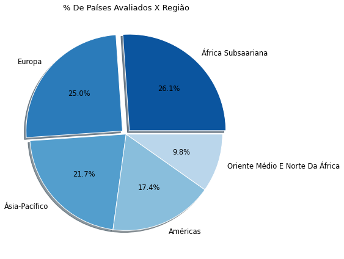

# Índice de Liberdade Econômica (EDA)

Neste projeto, apresento em detalhes uma análise exploratória atinente ao conjunto de dados do Índice de Liberdade Econômica (Index of Economic Freedom), que é uma pesquisa de ranqueamento que visa saber quais são os países mais livres no âmbito econômico e quais não são, além de que tal pesquisa estatística expõe como a liberdade econômica impacta notavelmente na riqueza de uma população.

As ferramentas utilizadas nesta análise exploratória foram Python como linguagem programática, Pandas como biblioteca para manipulação de dados, e por fim às bibliotecas Matplotlib e Seaborn foram utilizáveis conjuntamente para realizar plotagens de gráficos que expusessem com mais facilidade às informações que foram extraídas do conjunto de dados.

## Importação de Bibliotecas

```
import pandas as pd
import numpy as np
import matplotlib.pyplot as plt
import seaborn as sns

```

## Fonte de dados

O dataset [2022 Index Of Economic Freedom](https://www.heritage.org/index/explore) utilizado em tal análise exploratória está hospedado disponivelmente no site da Index Heritage Foundation para uso gratuito.

## Importação do Dataset 

Antes de podermos exportar o conjunto de dados, tivemos que instalar o pacote xlrd para exportarmos o dataset que estava configurado no formato .xlsx.

```
df = pd.read_excel('/content/drive/MyDrive/index2022_data.xls')
```
## Colunas do dataset

As colunas que estão contidas no conjunto de dados do índice de liberdade econômica são:

```
['pais_id', 'pais', 'webname', 'regiao', 'ranking_mundial',
       'ranking_regional', 'pontuacao_2022', 'direitos_de_propriedade',
       'eficiencia_juridica', 'integridade_governamental', 'carga_tributaria',
       'gastos_do_governo', 'saude_fiscal', 'liberdade_de_negocios',
       'liberdade_de_trabalho', 'liberdade_monetaria', 'liberdade_comercial',
       'liberdade_de_investimento', 'liberdade_financeira', 'taxa_tarifaria',
       'sem_nome', 'taxa_imposto_de_renda', 'taxa_de_imposto_corporativo',
       '%_carga_tributacao_pib', 'sem_nome_2', '%_despesas_gov_do_pib',
       'pais_2', 'sem_nome_3', 'populacao_milhoes', 'pib_bilhoes_per_capita',
       '%_crescimento_pib', '%_crescimento_pib_em_cinco_anos',
       'pib_per_capita', '%_de_desemprego', '%_de_inflacao',
       'entrade_de_ide_milhoes', '%_divida_publica_pib']
```       

## Processo de exploração dos dados

### **(1)** Tratamento dos dados

* Exclusão de colunas:

     **(1)** Antes de começarmos a exploração nos dados, tivemos que selecionar às colunas que seriam ou poderiam ser exploradas durante esse processo de análise, de antemão foi perceptível que há colunas que não serão exploráveis, e que à melhor opção seria com que tais colunas fossem excluídas, para que no processo analítico tivéssemos somente às colunas que poderiam ser do nosso interesse informacional.
 
   Tais colunas que foram excluídas, foram: 
   
   ```
   'webname', 'sem_nome_2', 
                   'pais_2', 'sem_nome_3', 'sem_nome'
   ```
* Seleção de índice:

    **(1)** Como temos uma coluna 'pais_id' que serve como identificador de cada país que foi analisado em tal pesquisa, então substituímos o índice automático criado pelo Pandas, para indexarmos a coluna 'pais_id' em seu lugar, justamente para não termos duas colunas de índices no dataset.
 
 
   ```
   df.set_index('pais_id', inplace = True)
   ```
 
 * Renomeação de coluna:

    **(1)** As colunas originalmente estavam escritas em inglês, porém traduzimos o nome das colunas para termos um entendimento mais claro e intuitivo do que cada coluna trata.
 
 * Criação de coluna:

    **(1)** Criamos a coluna 'avaliacao_final' para classificarmos quais são os países majoritariamente livres ou não-livres, moderadamente livres ou reprimidos, tal classificação foi feita com base nos critérios avaliativos da Index Heritage Foundation:
  
     **(a)** Países com uma pontuação de liberdade econômica entre 0 e 49.9 são classificados como países reprimidos, isto é, são países com baixa liberdade econômica.
  
     **(b)** Países com uma pontuação de liberdade econômica entre 50 e 59.9 são classificadamente países não-livres economicamente.
  
     **(c)** Países com uma pontuação de liberdade econômica entre 60 e 69.9 são classificadamente países moderadamente livres.
  
     **(d)** Países com uma pontuação de liberdade econômica acima de 70 são classificados como países majoritariamente livres, isto é, são países com alta liberdade econômica.
  
### **(2)** Conhecimento exploratório dos dados

Antes de começarmos à extrair em detalhes ás informações de tal conjunto de dados, precisamos esclarecer o conceito de liberdade econômica.

Basicamente, um país é considerado livre economicamente se e somente se tal país não tiver ou tiver pouquíssimas regulamentações burocráticas que impeçam a iniciativa privada de funcionar.

Em suma um país é livre economicamente se e somente se o país não tiver um estado que intervenha exageradamente na economia, por exemplo:

   **(a)** Se tal país não tiver regulamentações empresariais e trabalhistas que impeçam um empreendedor de abrir um negócio ou que impeçam um trabalhador de ser contratado. 
  
   **(b)** Se tal país não tiver um estado 'inchado' que atue em vários setores econômicos, e que impeça a iniciativa privada de atuar em tais setores.
  
   **(c)** Se tal país tiver baixas cargas tributárias ao ponto de aumentar o custo de produção dos empreendedores e impedi-los de investir.
  
Tais critérios citáveis acima, são um dos critérios que poderão influenciar para que um país seja considerado livre economicamente, um país majoritariamente livre, por exemplo, não precisa preencher todos os critérios acima, mas terá que preencher um ou dois de tais critérios citados.

À partir de tal explicação prévia do que é liberdade econômica, podemos começar tal análise exploratória, primariamente iremos responder uma questão simples de quais países e regiões mundiais que foram inclusos em tal pesquisa, e em qual proporção:

#### **(1)** Quantos países foram inclusos em tal pesquisa do índice de liberdade econômica?

Pelo método nunique() aplicado sob a coluna 'pais' obtemos como saída o número 186, isto é, 186 países foram inclusos na pesquisa do índice de liberdade econômica, quase todos os países do mundo foram inclusos na pesquisa, porém mundialmente temos 193 países reconhecidos, então tal pesquisa não inclui e não se refere à todos os países do mundo.

No entanto, desses 186 países registrados na pesquisa, aproximadamente 7 desses países tiveram colunas com dados nulos, e que consequentemente não receberam uma avaliação final que trouxesse as pontuações de liberdade econômica de tais países.

À partir de tal informação, poderemos simplificar tal número de países e separa-lo por regiões (ou continentes) para termos uma informação mais simplificada inclusos nesta pesquisa.

Desses 186 países registrados na pesquisa, quantos porcento destes países são localizados na Europa, nas Américas ou nas demais regiões do mundo?

A tabela abaixo responde tal questão:

|        index | regiao                       | qtd_paises |
|--------------|------------------------------|------------|
| 0            | Americas                     | 32         |
| 1            | Asia-Pacific                 | 40         |
| 2            | Europe                       | 46         |
| 3            | Middle East and North Africa | 18         |
| 4            | Sub-Saharan Africa           | 48         |
|              |                              |            |

Plotaremos um gráfico de pizza para termos uma representação mais visual das informações expostas acima na tabela:



À partir do gráfico acima, concluímos informacionalmente que 25 % ou 1 / 4 dos países avaliados são países europeus, 26 % dos países ou mais que 1 / 4 dos países avaliados são países localizados na África Subsaariana, 21 % dos países são países localizados na Ásia-Pacífico, 17 % dos países avaliáveis são países localizados nas Américas, e por fim 9 % dos países são do Oriente Médio e Norte da África, ou seja, o Oriente Médio e Norte da África são às regiões que tiveram menos países avaliados pelo índice de liberdade econômica.

Pela informação extraída em relação às regiões, queremos saber o grau de liberdade econômica de tais regiões:

#### **(2)** Quais são às regiões mundiais com às maiores pontuações de liberdade econômica?

Antes de respondermos tal questão, poderemos saber a porcentagem classificativa de liberdade econômica em relação à todos os países analisados representada por um gráfico de rosca:


O gráfico de rosca acima expressa informacionalmente que de todos os países avaliados pelo índice de liberdade econômica, 32 % dos países foram avaliados como países majoritariamente não-livres, 30 % dos países foram classificados como países moderadamente livres, 19 % dos países foram classificáveis como países majoritariamente livres e infelizmente 18 % como países reprimidos.

Tal informação acima é trágica, por expor que mais de 30 % dos países do mundo todo, são países com baixa liberdade econômica, e que quase 20 % dos países analisados são países que vivem em sistemas ditatoriais e autoritários com pouquíssima ou quase nenhuma liberdade econômica.

Dada a informação percentual do grau de liberdade econômica de todos os países, poderemos simplificar tal informação e trazermos um gráfico que represente quais são às regiões mundiais que apresentam países com alta, moderada ou baixa liberdade econômica.

O gráfico de barras empilhadas abaixo trará uma resposta visual para à pergunta **(2)**:


Pelo gráfico de barras empilhadas acima, é nitidamente observável que a Europa é a região com uma parcela mais significativa de países que são majoritariamente ou moderadamente livre, e com uma ínfima parcela de países que são majoritariamente não-livres, além de que a Europa é o continente que não contêm países que sejam considerados reprimidos.

Isto é, conclusivamente a Europa é a região do mundo com o maior grau de liberdade econômica, enquanto regiões como África Subsaariana, possui uma parcela notável de países majoritariamente não-livres ou reprimidos economicamente, e com uma pequena parcela de países que são moderadamente ou majoritariamente livres. 

Já às demais regiões, Américas, Ásia-Pacífico, Oriente Médio e Norte da África apresentam parcelas quase proporcionais (com algumas diferenças quantitativas visíveis) de países que são moderadamente ou majoritariamente livres ou não-livres, ou reprimidos.

